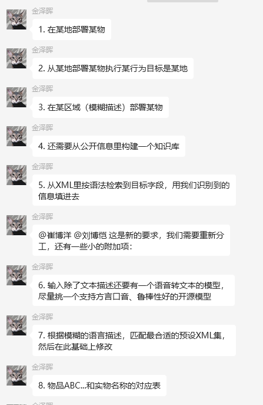

# 2025.06.16

* 模糊称谓如何提取，模糊提问的处理 --- lbk

* 大模型做固定格式化输出，不做中间层直接输出xml等 --- cby

* 适配问题，下周可看 --- 金博士

#### 伪造检测
* 造数据 复现算法 --- cby & lbk

# 2025.07.06

* 1. 调研语音转文本模型（刘博恺）
* 2. 基于公开知识建库（刘博恺）
* 3. 根据语义定位XML中的字段（待定）
* 4. 3种行为模式的识别（崔博洋）
* 5. 迭代更新完善demo（崔博洋）

具体要求

1. 在某地部署某物

2. 从某地部署某物执行某行为目标是某地

3. 在某区域（模糊描述）部署某物
大区域翻译为坐标，

4. 还需要从公开信息里构建一个知识库

5. 从XML里按语法检索到目标字段，用我们识别到的信息填进去

@崔博洋 @刘博恺 这是新的要求，我们需要重新分工，还有一些小的附加项：

6. 输入除了文本描述还要有一个语音转文本的模型，尽量挑一个支持方言口音、鲁棒性好的开源模型

7. 根据模糊的语言描述，匹配最合适的预设XML集，然后在此基础上修改

8. 物品ABC...和实物名称的对应表

# 2025.07.07

* 1. 调研语音转文本模型（刘博恺）

  三种模式的演示视频，
  目标

  zxk-->写专利

# 2025.07.11

llm查找数据库

* llm按属性逐步查找，
* 找到对象的json，

## 难点

* 模糊条件识别
* 定位具体对象、

* 更新xml 

## 分工

* xml结构重写
* 下周二交专利

# 2025.07.21
* 模块化可替代的方案
* c
* c
* c
* 周四演示
* 做出demo

* 合并和新增都要演示

* 在 (120N, 40E) 处部署50人的军队，配有4辆坦克，5辆导弹发射车
  * 在台湾以东 xx海域，部署 xx舰(001、辽宁舰、)， 装备xx导弹

*  在(15.812N, 50.7E) 部署4架爱国者导弹发射车，准备发射，打击目标为(-70.391N, 160.042E)，每辆发射车配有8枚爱国者导弹

   *  在 xx基地 部署x枚xx导弹 xx-xx-xx打击目标是xx市

*  在上海和北京交界处部署4架爱国者导弹发射车

   * 在xx沿海一带，部署xx飞机巡航，配有雷达

* 查找不会很复杂 

  不会出现相同武器 需要坐标确定具体元素的情况

# 2025.07.23
* 不再单独把区分部署的航母是否存在作为一个任务

* 在生成xml时自动检查 
  
  * 如果存在则返回原有xml文本，在原有的xml基础上进行修改
  * 不存在则创建xml标签，添加到末尾。
  
* 同音字的问题

  * 换一个嵌入模型
  * 换一个向量数据库
  * 

* 去现场之前准备问题

  * 列一下已知的

  

